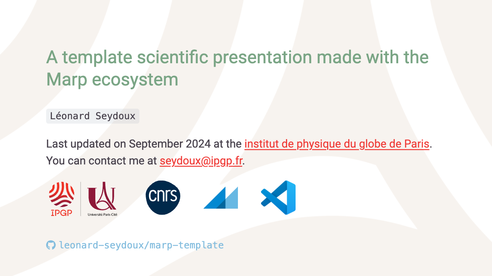

# Marp template

This repository is a template for creating a presentation using [Marp](https://marp.app/). It includes a basic structure for a presentation, and an IPGP theme written in [styles.css](styles.css):



## Usage

### Render the presentation

1. Clone this repository
2. Edit the `slides.md` file to create your presentation
3. Preview the presentation by opening the `slides.md` file in Marp preview mode in Visual Studio Code (or any other solution that supports Marp, check the [Marp documentation](https://marp.app/) for more information)
4. Export the presentation to any format (PDF, HTML, etc.) using the Marp extension in Visual Studio Code

### Use Markdown to create slides

Most of the [Marp Markdown syntax](https://marpit.marp.app/markdown) is supported in this template. You can create slides using the following syntax:

```markdown
---
marp: true  
---

## Slide 1

---

## Slide 2

---

## Slide 3
```

The `---` separator is used to create new slides. Lists render as bullet points, and you can use `##` to create headers.

The notable modification of the initial Marp syntax is the use of flex containers to create a two-column layout for the slides. You can use the following syntax to create a slide with two columns:

```markdown
## Slide with two columns

- Bullets points 
- Are rendered on the left
- Of the slide

But this image is on the right:

```

## Customization

In order to use your own theme, you can edit the [css/main.css](css/main.css) file, and register it in the Marp themes in your Visual Studio Code settings:

```json
{
    "markdown.marp.themes": [
        "https://example.com/foo/bar/custom-theme.css",
        "./themes/your-theme.css"
    ]
}
```

For more information about it, check [using custom CSS in Marp](https://marpit.marp.app/theme-css), and the [Visual Studio Code Marp extension documentation](https://github.com/marp-team/marp-vscode#use-custom-theme-css-shield).
